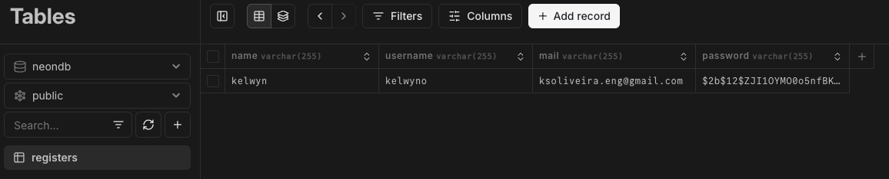

 

# 🔐📊 Streamlit Auth Dashboard

A minimal and extensible **login/register system** with `Streamlit` and `streamlit-authenticator`, connected to a **PostgreSQL** database hosted on **Neon**.

Streamlit app link: <a href="https://athentication-app.streamlit.app/" target="_blank">https://athentication-app.streamlit.app/</a>

---

## 📸 Preview




---

## 🔑 What it Does

| Feature                                  | Description                                                                 |
| ---------------------------------------- | --------------------------------------------------------------------------- |
| 🔐 Login & Register & Forgot Password UI | Form-based authentication using Streamlit widgets                           |
| 💾 PostgreSQL DB                         | User data persisted via Neon PostgreSQL                                     |
| 🧠 Session Logic                         | Seamless switch between login, registration and password recuperation modes |
| 🔒 Password Hashing                      | Secure storage using built-in hasher from streamlit-authenticator           |
| 🚪 Logout Support                        | Session-based logout button                                                 |

---

## 🧰 Tech Stack

| Tool                      | Purpose                     |
| ------------------------- | --------------------------- |
| `streamlit`               | UI framework                |
| `streamlit-authenticator` | Authentication handling     |
| `psycopg2-binary`         | PostgreSQL connection       |
| `python-dotenv`           | Environment variable loader |
| `Neon`                    | Cloud PostgreSQL hosting    |

---

## ⚙️ How to Run

### 1️⃣ Create a virtual environment (optional but recommended)

For macOS / Linux:

```bash
python3 -m venv .venv
source .venv/bin/activate
```

For Windows:

```bash
python -m venv .venv
.venv\Scripts\activate
```

---

### 2️⃣ Install dependencies

```bash
pip install -r requirements.txt
```

---

### 3️⃣ Create your `.env` file

Create a file named `.env` and add your database connection URL from [Neon](https://neon.tech):

```env
DATABASE_URL="your_postgres_connection_string"
```

---

### 4️⃣ Run the app

```bash
streamlit run main.py
```

---

### 5️⃣ Stop the app

To deactivate the virtual environment when you're done:

```bash
deactivate
```

---

## 🧠 Project Overview

- ✅ Built using Streamlit for fast web UI
- 🗂 Stores users in PostgreSQL (via `psycopg2`)
- 🔐 Uses `streamlit-authenticator` for credential management
- 🧩 Modular code: DB operations separated in `dependencies.py`
- 🔄 Dynamically fetches and updates users from the database

---

## 📂 Project Structure

```
streamlit_auth_app/
├── .venv                   # (not tracked)
├── .env                    # (not tracked)
├── assets
├── .gitignore
├── dependencies.py         # PostgreSQL DB functions
├── main.py                 # Streamlit login & dashboard logic
├── requirements.txt        # All Python dependencies
└── README.md               # This file!
```
